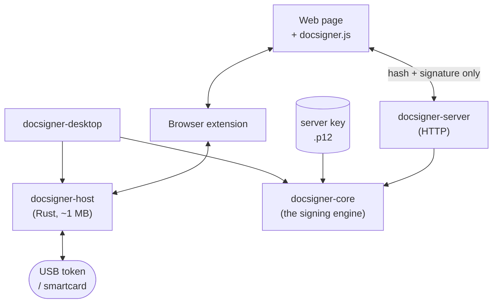
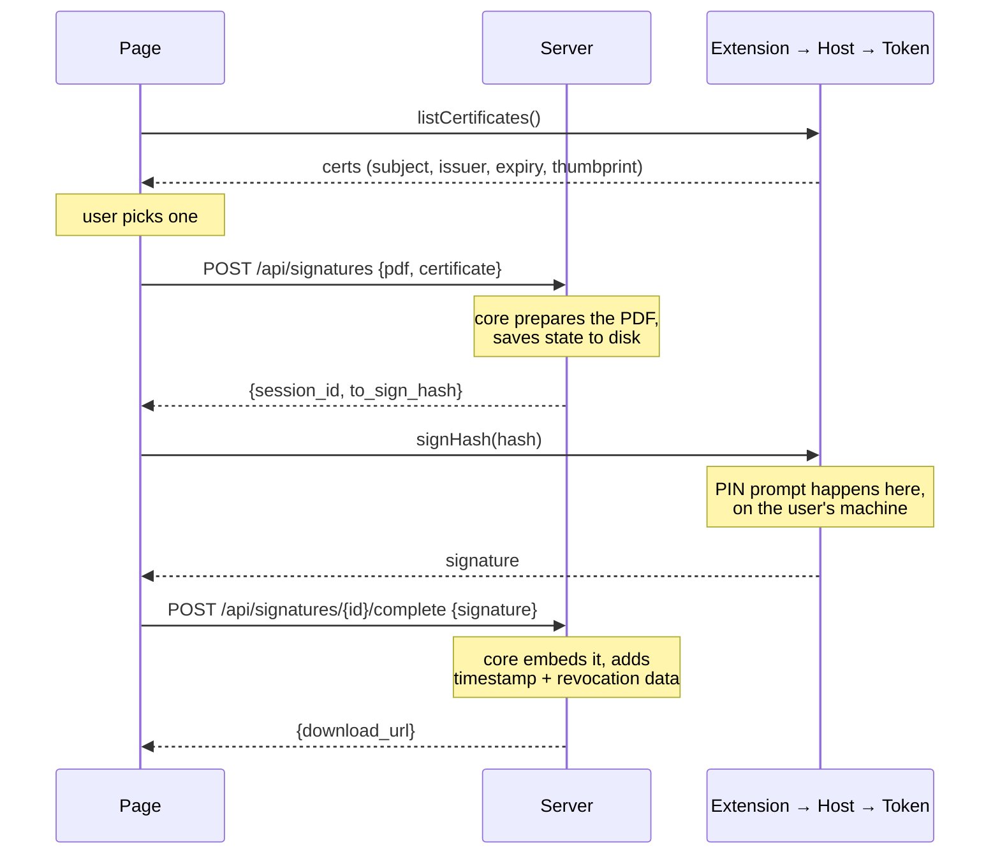
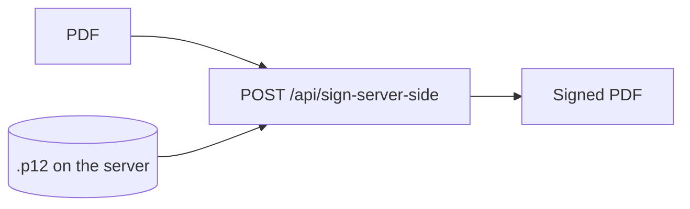

# Architecture, in plain words

How the pieces fit. Read this once and the rest of the repo makes sense.

## The one rule

**The PDF never leaves the server.** The browser carries a 32-byte hash out and
a ~256-byte signature back. That's it.

So a 200 MB file signs as fast as a 200 KB one, and the document never crosses a
network it doesn't have to.

## The pieces



| Piece | What it does | Docs |
|---|---|---|
| `docsigner-core` | Turns a PDF into a signed PDF. Everything calls this. | [core.md](core.md) |
| `docsigner-server` | HTTP wrapper around core. Holds the PDF. | [server.md](server.md) |
| `docsigner-host` | Reaches the USB token. The only piece that touches hardware. | [host.md](host.md) |
| Extension | Bridges a web page to the host. Does zero crypto. | [../extension/README.md](../extension/README.md) |
| `docsigner.js` | The page-side API. One file, no dependencies. | [../js/README.md](../js/README.md) |
| `docsigner-desktop` | Local app. Batch-sign a folder, no server, no browser. | [desktop.md](desktop.md) |

The exact wire between them is frozen in [CONTRACTS.md](../CONTRACTS.md). This
page is the picture; that one is the bytes.

## Flow 1: token signing (the two-step)

The token holds the private key and will not hand it over. So we prepare
everything, let the token sign one small hash, then glue the answer back in.



The hash the token signs is the digest of the CMS *signed attributes*, which
itself contains the document digest. No document bytes ever reach the token.

## Flow 2: server-held key (the one-shot)

Same core code, different signer. No session, no extension, no PIN.



## The browser hop chain

A page can't talk to a USB token. Four hops get it there, and each hop exists for
a reason:

```
page  ──CustomEvent──►  content script  ──runtime msg──►  background worker
                                                                  │
                                                          native messaging
                                                          (JSON over stdio)
                                                                  ▼
                                                          docsigner-host
                                                                  │
                                                              PKCS#11
                                                                  ▼
                                                             USB token
```

- **content script** runs in the page's world, so it's the only thing the page
  can reach. It relays, nothing else.
- **background worker** is the only context allowed to open native messaging.
- **host** is a separate process because browsers can't load a PKCS#11 driver.

The PIN is typed in the host's own dialog. It never touches the browser, the
page, or the network.

## Decisions, and why

**Sessions live in files, server-side.** A start call writes core's pending state
plus the prepared PDF to a directory with a random ID and a TTL. Finish reads it
back. No database, no Redis. Mount the directory anywhere if you need it shared.

**The host is dumb on purpose.** List certificates, sign a hash, done. All PDF
knowledge, all policy, all validation lives in core. That's what keeps the
extension and the host stable while the server grows features.

**Origin consent instead of licensing.** First time a website asks for
certificates, the extension shows a prompt, remembered per origin. Same pattern
Web eID uses.

**One PIN, many signatures.** Batch signing keeps the PKCS#11 session open and
signs N digests in one go. The API takes an array of hashes from the start. Cheap
now, painful to retrofit.

**Errors are part of the API.** Token unplugged, wrong PIN, PIN locked, cert
expired, user cancelled. Each gets a stable code that reaches the page. Signing
UX lives or dies on these messages.

**Rust for the host, Python for everything else.** The host's whole job is
PKCS#11 plus JSON, and every dependency it needs has a mature crate. Result: 1 MB
instead of 45 MB, and no bundled runtime. The signing engine has no such
equivalent, because replacing pyHanko means hand-writing PAdES, path validation,
OCSP/CRL and RFC 3161. Wrong risk for a product whose value is that the signature
holds up.

**No hand-written SDKs.** One per language is one more thing to drift from the
contract. [`server/openapi.json`](../server/openapi.json) is committed, so
generate a client and it stays current by construction.

## Standards

PDF signing converged internationally, so covering a new country is mostly
configuration: its tokens speak PKCS#11 (they all do), and the server gets the
right trust anchors and profile.

| Profile | What it adds |
|---|---|
| B-B | The signature. |
| B-T | RFC 3161 timestamp. |
| B-LT | Embedded revocation data (OCSP or CRL). Needs `TRUST_DIR`. |
| B-LTA | Archival timestamp chain on top of B-LT. |
| CCA-LTV / CCA-LTA | India's CCA variants (revocation data in the `pdfRevocationInfoArchival` attribute, per ESAIG 1.19). |

Beyond PDF: detached CAdES-BES (`.p7s`) over any file in both flows, and
enveloped XAdES-B over XML with a server-held key.

Keys: RSA and ECDSA, SHA-256/384/512.

## What we skipped, on purpose

- **Safari.** Needs a signed macOS app wrapper. Parked until someone asks.
- **EU trust lists.** EU trust arrives as signed per-country XML (EUTL, ETSI TS
  119 612) and needs a parser. A folder of PEM files covers every other region.
- **A database.** Files and TTLs cover the session store. See above.
- **RSA-PSS.** Nearly every DSC token uses PKCS#1 v1.5. Later, if a token needs it.
