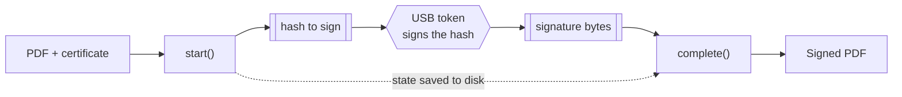
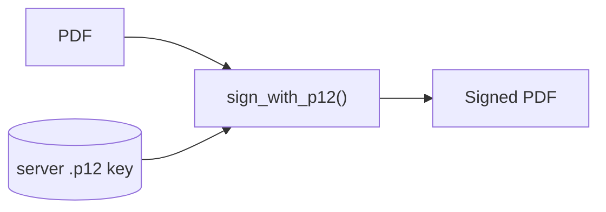

# signer-core, in plain words

The library that turns a PDF into a **signed** PDF. Everything else in the repo
(server, host, desktop, the Frappe app) calls this.

## The gist

- A signature proves two things: **who** signed, and that the file **did not change** after.
- The private key can live in two places:
  - on a **server** (a `.p12` file) — sign in one shot.
  - on a **USB token** in someone's hand — the key never leaves the token, so signing happens in **two steps** (hand the token a hash, get the signature back).
- Core also: checks a signed PDF (`validate`), signs non-PDF files (`cades`), signs XML (`xades`), draws the visible stamp (`appearance`), and adds long-term proof (`ltv`).

## The two-step token dance

Why two steps? The token holds the key and will not give it up. So we prepare
everything, let the token sign one small hash, then glue the answer back in.



- `start()` — prepare the PDF, hand back one hash. Also saves a **state** blob.
- the token signs that hash (could be a different machine, minutes later).
- `complete()` — take the signature + the saved state, produce the signed PDF.
- long-term profiles (B-LT, B-LTA, CCA) add revocation proof and a timestamp here.

## The one-shot (server key)



No dance — the server holds the key, so it signs in one call.

## Module map (where things live)

In `core/signer_core/`:

- `cms.py` — shared bricks both flows use (parse cert, verify sig, save/load state).
- `pdf_sign.py` — the token two-step for PDFs.
- `oneshot.py` — the server-key one-shot for PDFs.
- `cades.py` / `xades.py` — sign other files / sign XML.
- `profiles.py` — the signature "levels" (B-B up to CCA) and what each needs.
- `policies.py` — signature policy identifiers, for PKIs that grade on one.
- `appearance.py` — the visible stamp (name, date, QR, handwriting).
- `ltv.py` / `trust.py` — long-term proof and who we trust.
- `validation.py` — read a signed PDF back and report if it is good.
- `pdfa.py` — spot a PDF/A input, so signing can keep its conformance.
- `rendering.py` — turn a page into an image for a placement UI.
- `errors.py` — the error codes the contract puts on the wire.

---

## For developers

Install (from repo root):

```bash
pip install -e ./core          # add [render] for rendering.py
```

**One-shot, server key:**

```python
from signer_core import sign_with_p12

signed = sign_with_p12(pdf_bytes, "key.p12", "passphrase", {"profile": "B-B"})
```

**Token two-step** (the hash is signed elsewhere — a token, an HSM, a browser):

```python
from signer_core import SigningSession

state, to_sign, alg = SigningSession.start(pdf_bytes, cert_der, {"profile": "B-T"})
# ... hand `to_sign` to the token, get `signature` back ...
signed = SigningSession.complete(state, signature)
```

The `state` is JSON-safe bytes (`state.to_bytes()` / `SessionState.from_bytes(...)`),
so `start` and `complete` can run in different processes.

**A visible stamp** (in the `options`):

```python
options = {
    "profile": "B-T",
    "appearance": {
        "position": "bottom-right",     # or an explicit "box": [x1,y1,x2,y2]
        "style": "handwritten",         # draws the name in a script font
        "reason": "Approved",
    },
}
```

**Check a signed PDF:**

```python
from signer_core import validate

for sig in validate(signed_pdf, trust_dir="trust/"):
    print(sig["signer"], sig["valid"], sig["trusted"])
```

**Detached CAdES** (sign any file, get a `.p7s`):

```python
from signer_core.cades import CadesSession

state, to_sign, alg = CadesSession.start(file_bytes, cert_der, {"profile": "B-T"})
p7s = CadesSession.complete(state, signature)
```

Profiles, options, and error codes are frozen in [../CONTRACTS.md](../CONTRACTS.md).
