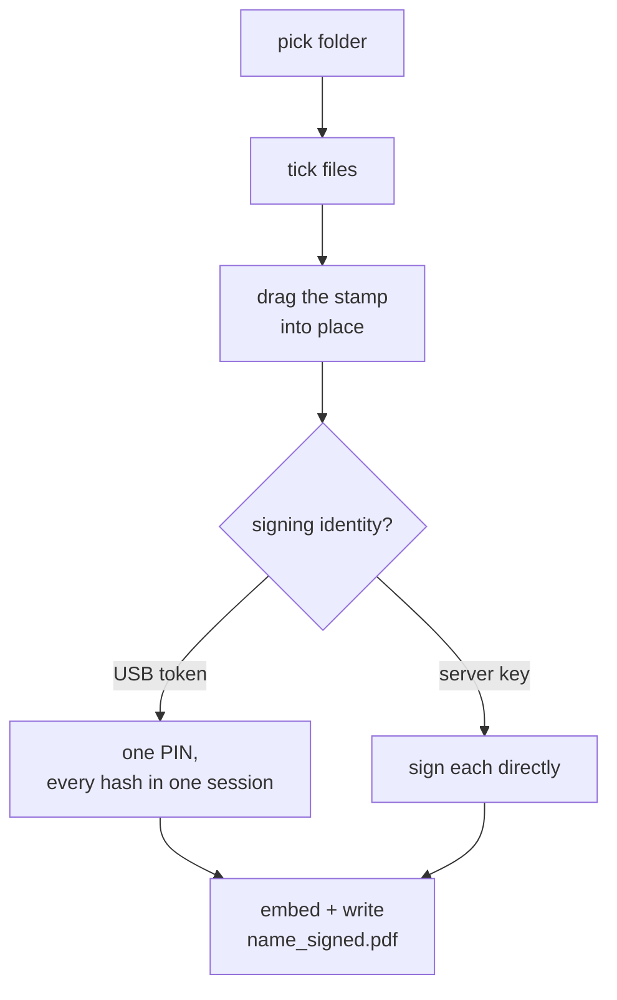

# docsigner-desktop, in plain words

A local app for signing a pile of PDFs at once. No server, no browser, no
upload. Load a folder, drag the signature where you want it, sign everything.

## The gist

- Point it at a folder. Tick the PDFs you want signed.
- **Drag the signature box** onto the page and resize it. What you see on screen
  is what lands in the file.
- One placement covers the whole batch, even when pages are different sizes.
- Sign with a **USB token** (one PIN for the folder) or a **server-held key**.
- Signed copies are written next to the originals as `name_signed.pdf`. Nothing
  is uploaded, nothing is deleted.
- The signing is [signer-core](core.md) running in the same process, so the output
  is identical to the server's.

## How a batch runs



For each file the backend converts your fractional placement into PDF points for
that page, which is why one placement stays correct across page sizes.

## The two identities

- **DSC token.** The main path. [docsigner-host](host.md) reads the token's
  certificates and signs them. It runs as a fresh subprocess per call, the same
  model the browser extension uses, which sidesteps the per-process slot state
  some token drivers cache and would otherwise wedge a long-lived scan.
- **Server-held key** (`.p12`). A self-signed test key is created on first run
  under `~/.config/docsigner-desktop/signing-keys/`, so the app works with no
  token plugged in. Drop your own `.p12` there to use it.

Both show up in the same certificate menu.

## The stamp

Appearance profiles work the way Acrobat's do: a handwritten name, an uploaded
image, or plain text, plus date, reason and location. Save one under a name and
reuse it.

Five handwriting faces, one per personality: Calligraphy, Casual, Pen, Brush,
Neat script. They're the same OFL fonts core embeds into the PDF, and the
preview loads those same files, so what's on screen is what gets signed.

*Add your own* takes a `.ttf` or `.otf` and it joins the list under its
filename. Uploads live in `~/.config/docsigner-desktop/fonts/` and are handed to
core's font registry at startup, so a profile keeps working after a restart. A
file the stamp renderer can't open is refused at upload, not at signing time.

The picker offers those two sets and never the fonts installed on the machine:
the signer can only embed a face it has the file for, and a preview in a font
the signed file can't use would lie. Uploading is how a system font becomes
usable — it hands over the file.

## Module map (where things live)

Backend (`backend/docsigner_desktop/`):

- `app.py` — the HTTP routes the window talks to; also serves the built UI.
- `signing.py` — the bulk run: placement to points, appearance mapping, both identities.
- `certs.py` — the signing identities, and the self-signed test key on first run.
- `host.py` — reaching the token, one subprocess per call.
- `fonts.py` — the handwriting faces, core's plus any the user adds.
- `config.py` — timestamp authority and trust anchors.
- `store.py` — settings and appearance profiles, remembered between launches.
- `picker.py` — the native file and folder dialogs.
- `models.py` — request and response shapes; placement is fractional (0..1).
- `__main__.py` — opens the native window (or `--server` for headless).

Frontend (`frontend/src/`):

- `components/PlacementCanvas.tsx` — drag and resize the signature box.
- `components/SetupPanel.tsx` — certificate, profile, standard, output.
- `components/ProfileEditor.tsx` — the appearance profiles.
- `components/StampPreview.tsx` — live preview of the stamp.
- `components/PinDialog.tsx` — the PIN prompt.
- `App.tsx`, `api.ts`, `types.ts` — the shell, the fetch layer, the shapes.

---

## For developers

Build the frontend once, then run the backend on Python 3.12:

```bash
cd frontend && pnpm install && pnpm build
cd ../backend && python3.12 -m venv .venv
./.venv/bin/pip install -r requirements.txt
./.venv/bin/python -m docsigner_desktop
```

Hot reload, packaging into a `.app` / `.exe`, and what to do before you hand a
build to someone: [`../desktop/README.md`](../desktop/README.md).

`DOCSIGNER_HOST_BIN` points the app at a different signing host, as long as it
speaks the same CLI (`list`, `sign`, `version`) and prints the same JSON. That's
how the Rust host gets exercised against the real app.
