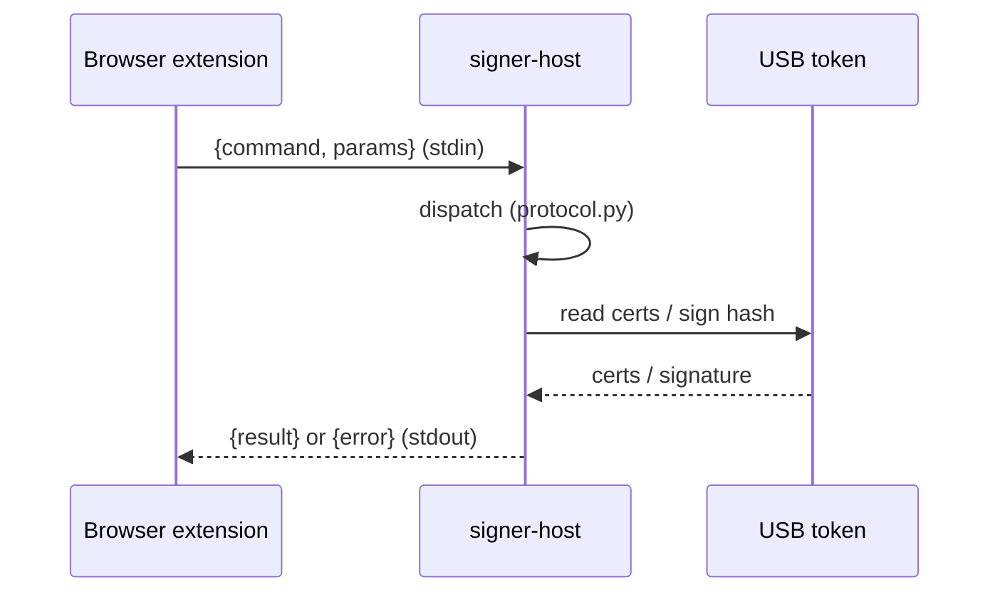
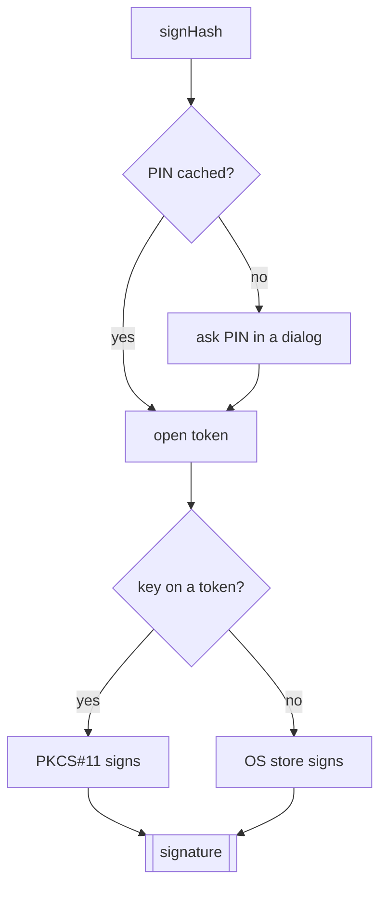

# signer-host, in plain words

The little native app that talks to the **USB token / smartcard**. A browser
cannot reach a token on its own, so it launches this and talks to it.

## The gist

- The browser extension speaks to the host over **native messaging** (JSON in, JSON out, over stdin/stdout).
- The host can reach the key two ways:
  - **PKCS#11** — the token's own driver.
  - **OS store** — the Keychain (macOS) or the MY store (Windows), which the driver often registers too.
- The **PIN is typed here**, in a native dialog. It never touches the browser or the network.
- If a token is plugged in but its driver is missing, the host still says *"WatchData detected, install its driver"* instead of showing nothing.

## What a request looks like



Four commands (full shapes in [../CONTRACTS.md](../CONTRACTS.md) section 2):

- `getVersion` — who am I, where is the log.
- `listCertificates` — every cert on every token + the OS store.
- `signHash` — sign one or more hashes (one PIN prompt for the batch).
- `checkUpdate` — is a newer host out there.

## Signing a hash



- one PIN prompt covers a whole batch of hashes.
- a good PIN is remembered for 10 minutes (in memory only, dies with the host).
- token first; fall back to the OS store only when the token has no such cert.

## Module map (where things live)

In `host-rs/src/`:

- `main.rs` — the stdin/stdout loop the browser launches. With arguments, the CLI instead.
- `cli.rs` — the same commands from a terminal. Also how the desktop app calls this.
- `protocol.rs` — reads the command, calls the right handler, always replies.
- `framing.rs` — the 4-byte length prefix the browser wire needs.
- `certs.rs` — turn a raw certificate into the JSON fields the contract wants.
- `pkcs11.rs` — the token backend (driver).
- `os_store/` — the Keychain (macOS) and MY store (Windows) backend.
- `modules.rs` — where token drivers live on disk.
- `pcsc_readers.rs` — which token is plugged in (works even with no driver).
- `procs.rs` — what other app might be hogging the token.
- `pin.rs` — the PIN dialog.
- `notify.rs` — the "signed X" desktop popup.
- `update.rs` — the version check.
- `error.rs` — the 8 error codes the contract allows on the wire, and nothing else.
- `logging.rs` — one timestamped line appended to one file.
- `testenv.rs` — env vars that don't race, for the tests.

---

## For developers

The host is a Rust binary of about 1 MB, with no runtime to install. Build it
and try it against your own token:

```bash
cargo build --release --manifest-path host-rs/Cargo.toml
```

```bash
host-rs/target/release/docsigner-host list      # certs on your token
host-rs/target/release/docsigner-host version
```

Sign a base64 hash from the terminal:

```bash
docsigner-host sign \
  --thumbprint ab12cd... \
  --hash <base64-digest> \
  --alg sha256
```

- set `DOCSIGNER_PIN` to skip the dialog (tests, scripts).
- point at a driver the built-in list misses: `export DOCSIGNER_PKCS11_MODULES=/path/to/pkcs11.so`.
- set `DOCSIGNER_NO_NOTIFY` to silence the popup.

**Adding a token backend?** Copy the shape of `src/os_store/`: expose
`list_der()` and `sign(thumbprint, digests, alg)`, build entries with
`certs::cert_info(...)`, and `protocol.rs` will merge yours in.

Packaging and registering it with browsers is in the
[host README](../host-rs/README.md).
