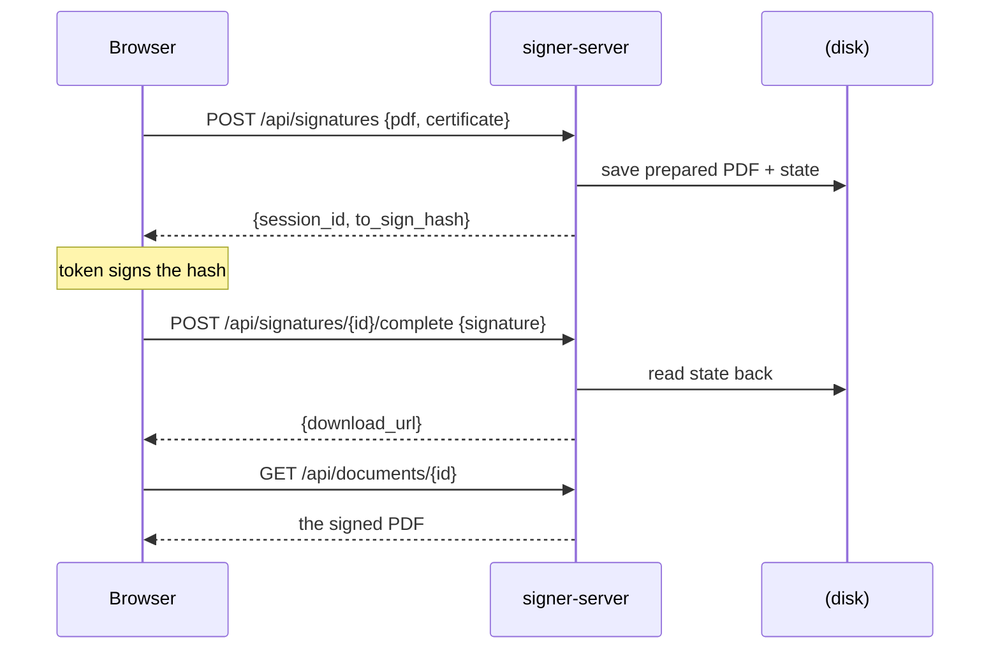

# signer-server, in plain words

The HTTP layer over [signer-core](core.md). It holds the PDF so the browser
doesn't have to.

## The gist

- Someone uploads a PDF. The server keeps it and hands back **one 32-byte hash**.
- The browser signs that hash with the token and posts the signature back.
- The server glues it in and returns a download link.
- The PDF never travels to the browser, so file size costs nothing.
- It also signs in **one shot** with a key held on the server (`.p12`), no browser involved.
- Everything it knows how to do comes from core. This package only speaks HTTP.

## What a signing run looks like



Sessions and finished documents are **files with a TTL**. No database. A session
expires in 15 minutes, a document in an hour, both configurable.

## The routes

| Route | What it's for |
|---|---|
| `POST /api/signatures` | Start a token signature, get the hash |
| `POST /api/signatures/{id}/complete` | Hand back the signature, get the PDF |
| `POST /api/signatures/batch` + `/batch-complete` | Same, N documents, one PIN |
| `POST /api/sign-server-side` | One shot with the server's own key |
| `POST /api/validate` | Read a signed PDF back, report who signed and whether it's good |
| `GET /api/documents/{id}` | Download a finished document |
| CAdES + XAdES routes | The same shapes for non-PDF files and XML |

Exact bodies, fields and error codes: [CONTRACTS.md](../CONTRACTS.md) section 1.

## Module map (where things live)

- `app.py` — the routes. Thin: every real decision happens in core.
- `models.py` — the request and response shapes, so the OpenAPI document is worth something.
- `config.py` — reads plain environment variables (and a `.env` file if one's there).
- `store.py` — the file-backed session and document store, with the TTL sweep.
- `__main__.py` — `python -m signer_server`.

---

## For developers

Run it (Python 3.10+, from the repo root):

```bash
pip install -e ./core -e ./server
cp .env.example .env
python -m signer_server            # http://127.0.0.1:8001
```

Run and deploy steps, every environment variable, and how to build a wheel:
[`../server/README.md`](../server/README.md).

**Generate a client** instead of writing one. The OpenAPI document is committed:

```bash
npx openapi-typescript server/openapi.json -o signer.d.ts
```

Every body is typed and the error codes come through as an enum you can switch on
exhaustively. `server/tests/test_openapi.py` fails if the committed document
drifts from the routes. Regenerate with `python scripts/export_openapi.py`.

**Skip HTTP entirely** if you already run Python: `pip install -e ./core` and call
[signer-core](core.md) in process. That's what the Frappe app does.
